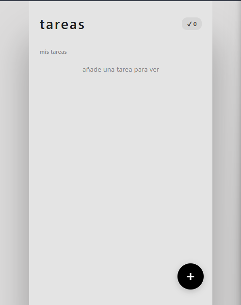
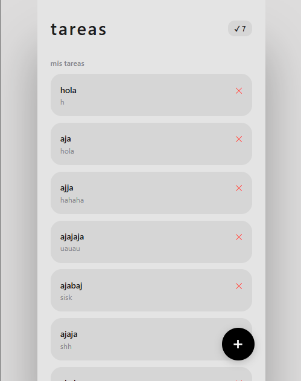
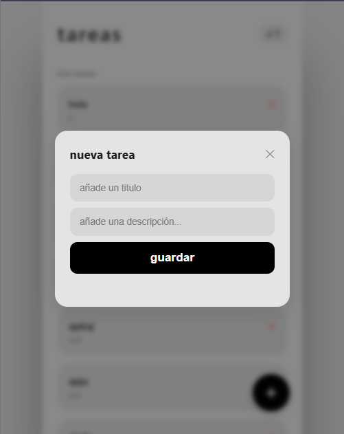

# Prueba Técnica - Desarrollador Jr

Hola, Esta es mi solución para la prueba técnica de Desarrollador Jr.

## Características

- **Backend Modular:** API RESTful estructurada con separación de responsabilidades (Controladores y Rutas).
- **Frontend Clean Code:** Interfaz de usuario minimalista inspirada en iOS, construida sin frameworks externos.
- **Responsividad:** Diseño Mobile-First con un Floating Action Button (FAB) y modal.
- **Operaciones CRUD:** Capacidad para listar, crear y eliminar tareas en tiempo real.

## Vista Previa





## Tecnologías Utilizadas

**Backend:**
- Node.js
- Express.js
- CORS
- Crypto (Generación de UUIDs)
- Nodemon (Desarrollo)

**Frontend:**
- HTML5 Semántico
- CSS3 (Custom Properties, Flexbox, Scroll personalizado)
- Vanilla JavaScript (Fetch API, Async/Await)

## Estructura del Proyecto

El proyecto está dividido en dos directorios principales para mantener la separación entre el cliente y el servidor:

```text
/ developer-jr-challenge
├── assets/
│   ├── main-view-empty.png
│   ├── main-view.png
│   ├── modal-view.png
├── backend/
│   ├── src/
│   │   ├── controllers/
│   │   │   └── task.controller.js
│   │   ├── routes/
│   │   │   └── task.routes.js
│   │   └── index.js
│   └── package.json
└── frontend/
    ├── index.html
    ├── styles.css
    └── app.js
```

## Cómo ejecutar el proyecto localmente

Sigue estos pasos para levantar el entorno de desarrollo en tu máquina local.

### 1. Clonar el repositorio
\`\`\`bash
git clone https://github.com/dxbae-dev/developer-jr-challenge.git
cd developer-jr-challenge
\`\`\`

### 2. Levantar la API (Backend)
Abre una terminal, navega a la carpeta del backend, instala las dependencias y arranca el servidor:

\`\`\`bash
cd backend
npm i
npm run dev
\`\`\`
El servidor estará corriendo en `http://localhost:3000`.

### 3. Levantar la Interfaz (Frontend)
El frontend no requiere instalación de dependencias. Puedes ejecutarlo de cualquiera de estas formas:
- Abriendo el archivo `frontend/index.html` directamente en tu navegador web.
- Utilizando una extensión como **Live Server** en VS Code para recarga en caliente.

## Documentación de la API

| Método | Endpoint          | Descripción                 | Body de Ejemplo                          |
|--------|-------------------|-----------------------------|------------------------------------------|
| GET    | `/api/tasks`      | Obtiene todas las tareas    | -                                        |
| POST   | `/api/tasks`      | Crea una nueva tarea        | `{ "title": "Estudiar", "description": "Repasar Node.js" }` |
| DELETE | `/api/tasks/:id`  | Elimina una tarea por ID    | -                                        |

---
**Autor:** Gerardo Daniel Ramirez Baena